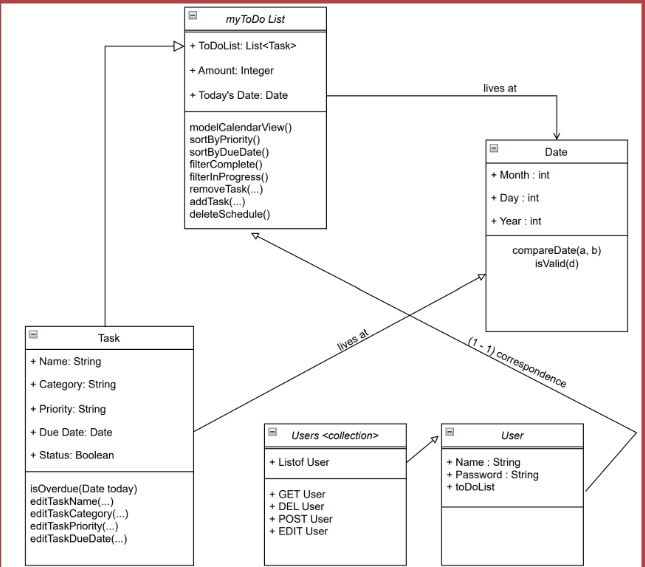
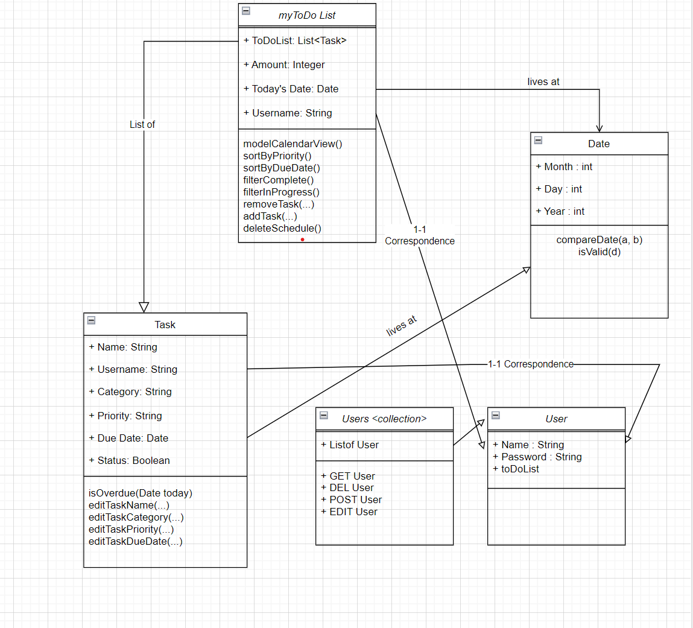

# MyToDo

Product Vision: For college students who need to be organized, OnTrack is a to do list that caters to a college student’s schedule. Unlike reminders, paper to-do lists, google calendar, etc, our product allows for prioritization, tasks categorization, and filtration.

Description: Users have the ability to add tasks with name, priority, category (Work, School, Other), optional label (like class) and due date. These tasks appear as cards sorted by due date into three columns and can be filtered by priority using the drop down, or by category using the sidebar navigation. Users can cross out tasks by clicking the text or delete them from view entirely by clicking the checkmark icon. Each user can keep their tasks saved with logging in. OnTrack functions as a useful organization tool for students to keep track of their assignemnts, work tasks, and other responsibilities.

## UML Diagram - Initial 

Initial UML: Our initial vision was to have a simple to do list app,
with authentication, that kept track of the name, category, priority,
date, and status of each task, with an overarching list of tasks.
Additionally, there would be a list of users with their name, password, 
and corresponding toDoList.

# UML Diagram - Final (11/20/23)

Final UML: Our final vision was very similar to the initial UML above, but
changed to be more accomodating with Authentication. Each task would have
a username field connecting it to a specific user and the overarching toDo
list would have a username as well to filter by.

