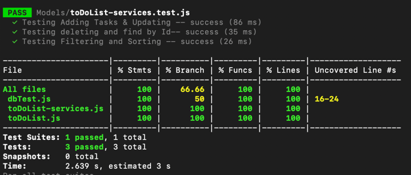

The following shows the result of running the toDoList-services.test.js. The jest test uses a simulated database to run
the tests, so in order to run the, make sure to install mongodb-memory-server with the commant npm i mongodb-memory-server
and to comment out the the area noted in the file toDoList-services.js. Finally run npm test -- --coverage to get the current
coverage report

